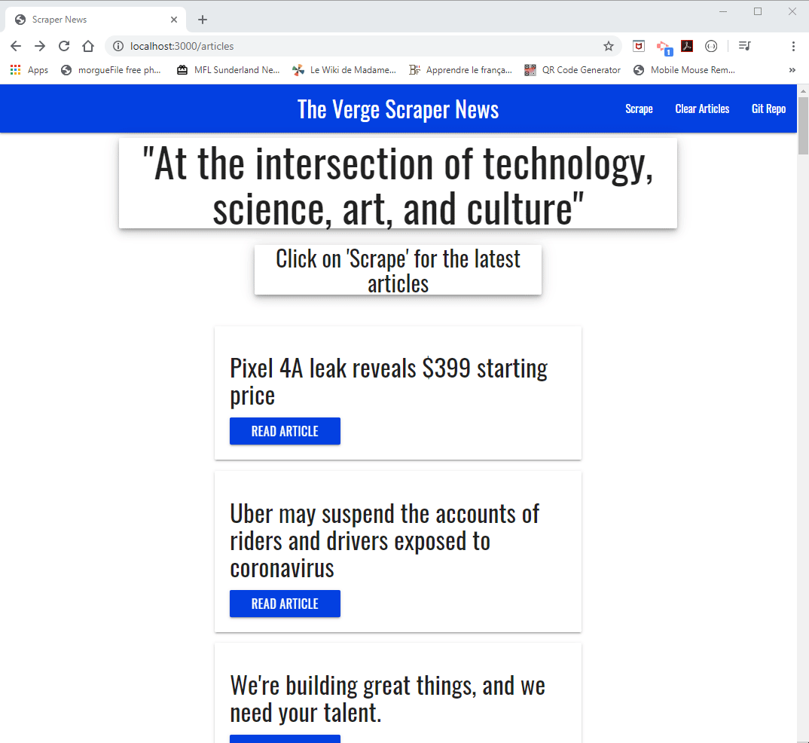

# scraper_news

## Table of Content ##
*Overview,*
*Installation,*
*Technologies used,*

## Overview ##
 Users click on "scrape" and et the titles of the www.theverge.com show up. Then you click on the read article. You can also leave a comment on the article as well as erase all the article if needed

## Installation ##
### Step 1: Git Clone ###
Clone scraper_news to your local git repo like the following:

The scraper_news project and its files should now be in your project folder.

### Step 2: Install Dependencies ###
Install the following dependencies listed in the *package.json* file:

*mongo*
*mongoose*
*handlebars*
*express*
*cheerio*
*body-parser*

Once completed, you will see a *package.json* file in your local repo.

### Step 3: Coding with Mongoose ###
Connect Mongo to your app

### Step 4: start the localhost ###
In your bash Windows you type *node server* after typing mongo. It will connect your app to the local port 3000. Then you can go online to use the app

## How it works ##

## Technologies used ##
*Node.js*
*Javascript*
*NPM packages:* 
*mongo*
*mongoose*
*handlebars*
*express*
*cheerio*
*body-parser*
*axios*
  
## Authors ##
Sylvain David - Vanderbilt Bootcamp - 2020